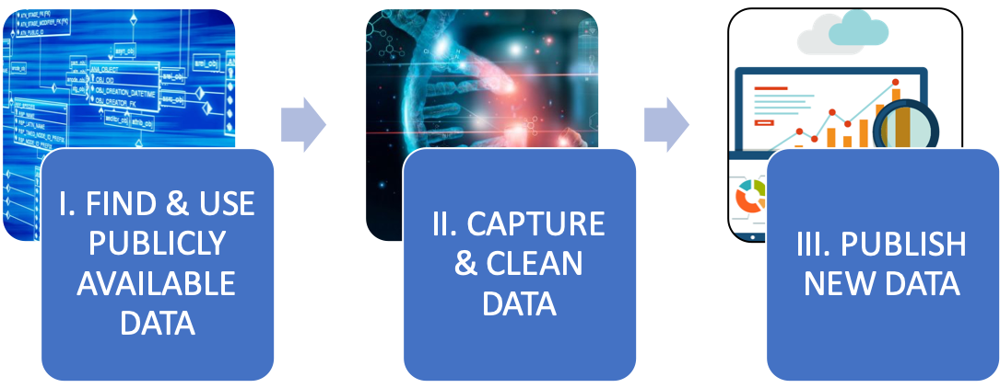
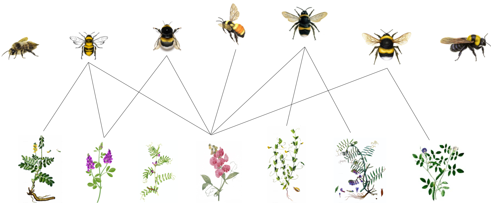
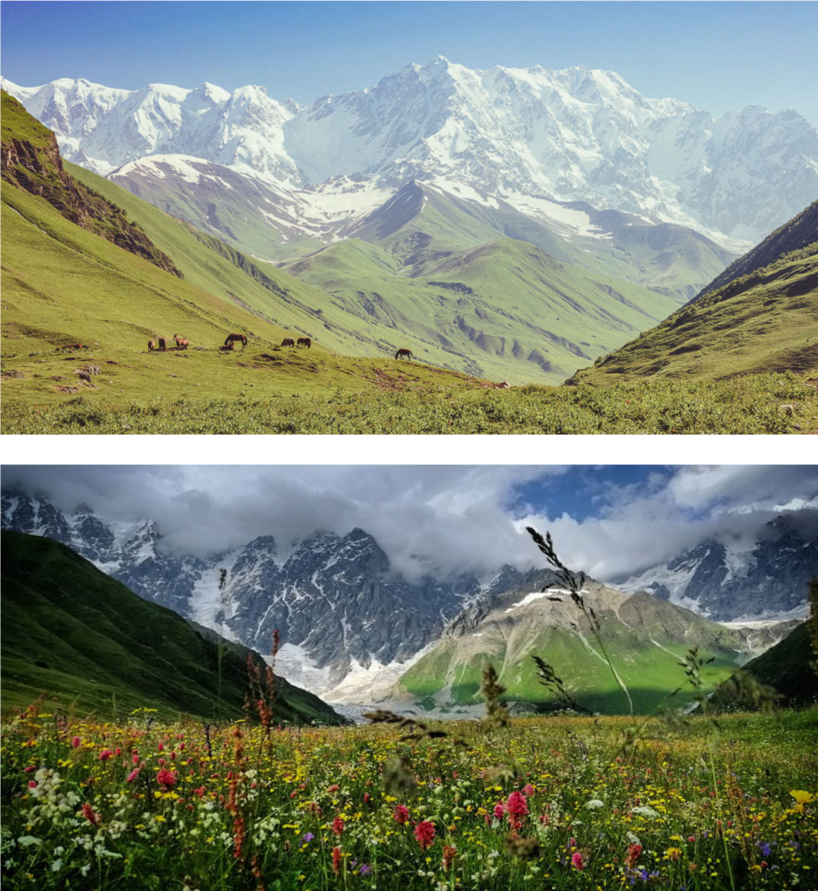
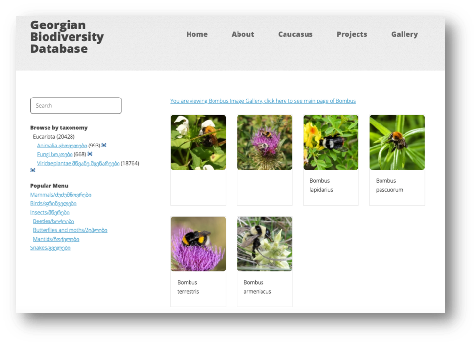
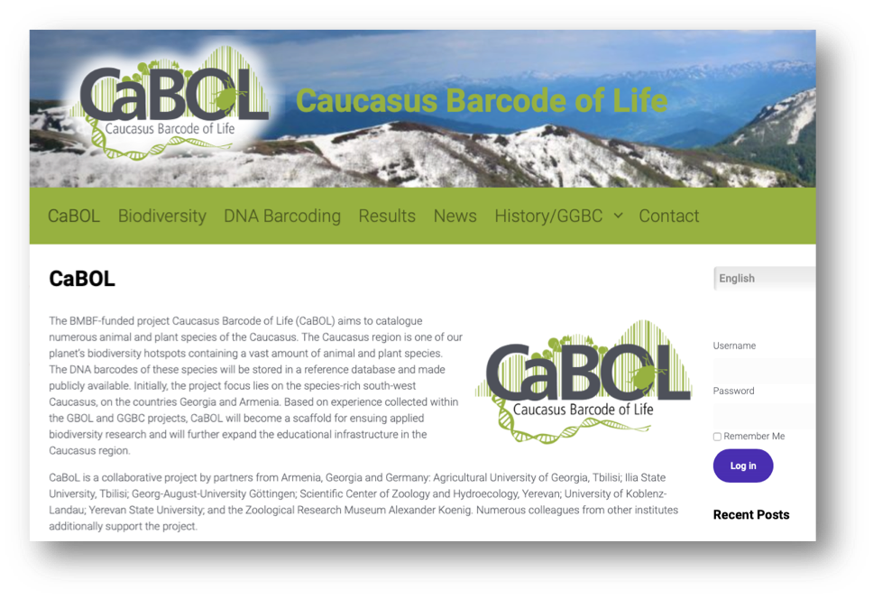
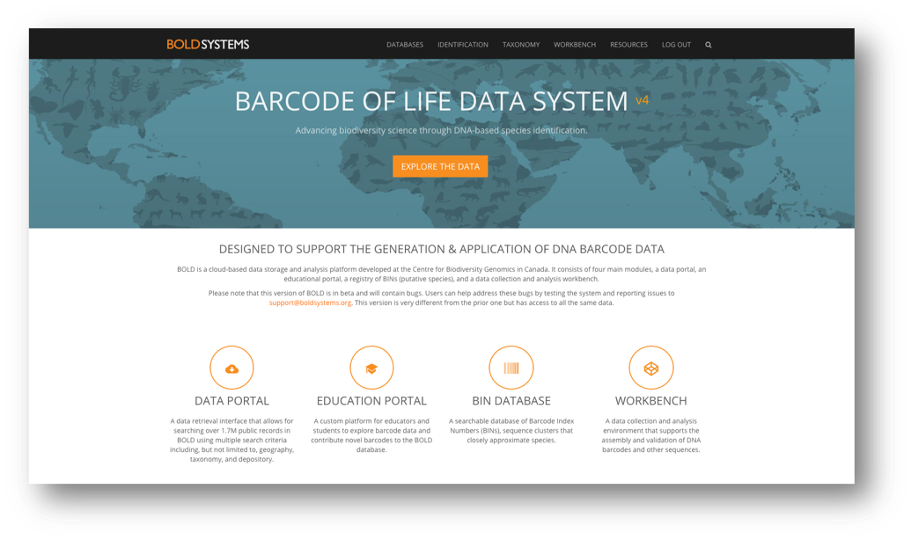
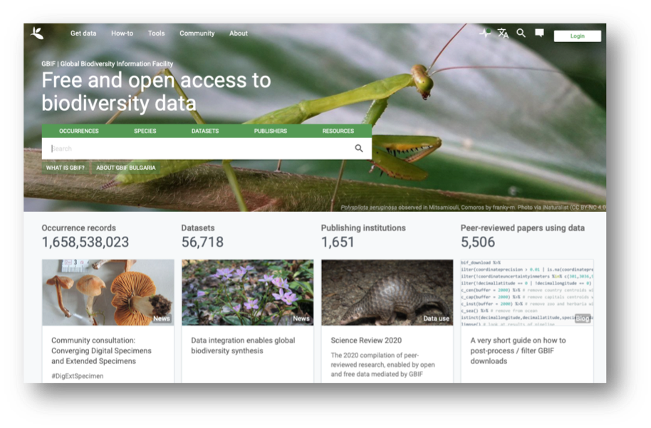
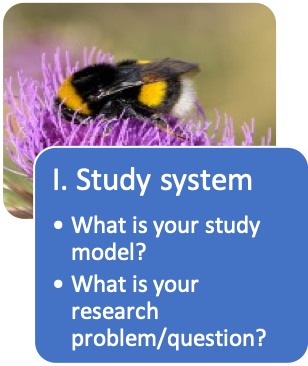

== Data journey - bumblebee pollinators

[NOTE.objectives]
This data journey is a series of practical exercises focusing on bumblebee pollinators. 
Using GBIF and BOLD, you will learn: I. how to find and use already available biodiversity data in connexion with your research questions; II. How to efficiently capture and clean this data – i.e. put them in a standard format that is directly relevant and exploitable for you; III. How to generate and publish new data according to a international standards.

[NOTE.activity]
This data journey is comprised of nine steps. 
Each step (or set of steps), correlate to the different modules of the course. 
After a series of theoretical lectures, you will return to the Data Journey to complete the practical exercises. 
The practical exercises follow a path: I. the study system; II. questions and hypotheses; III. availability of data; IV. capture and cleaning of data; and V. generate and publish data.

image::img/web/DJC/DJC-1.png[align=center,width=640,height=360]

=== Study system

:figure-caption!:
.Bombus-Vicia pollination network

==== Bumblebee pollinators

. What do we know about bumblebees in the Caucasus region?
.. How many species? Where are they distributed?
.. What are their preferred plant resources?
. Identify simple and clear research question
.. What resources and type of data you will need?
.. How much of this data already exists?

==== Caucasus ecoregion

* One of the most species-rich regions in the world
* High endemism rates
* Accelerate biodiversity discovery
** Systematics
** DNA barcoding
** Biological metadata
* Some biodiversity data is already available
* Identify relevant datasets
* Mobilize them for addressing scientific & conservation issues
* Identify data gaps for future research

==== Public biodiversity databases

You may find the data in the ecoregion is not publicly available in all the databases so you will need to reflect on your strategy.

=== Step 1

In Step 1, you will develop your research questions.

NOTE: In a workshop setting, complete Step 1 as a group. Select a recorder/reporter to report back after task 3 is complete.

==== Task 1

Take 5 minutes to complete the following:

. Form your research question(s)
. Where is data available (or not available)?
. Draw a schematic of your question and plan to answer your question.

==== Task 2

Take 25 minutes to complete the following using publicly available databases:

. Search for different species based on their names.
.. Are there any records?
. How much overlap in available records do you observe between different databases?
. What possible research questions can you formulate?
. Do you have the necessary data?

==== Task 3

Take 10 minutes to complete the following:

. Reflect on your experience in task 2 and further refine your project goals.

=== Step 2

In Step 2, you will begin to work with species identifications using GBIF and the Georgian Biodiversity Database (GBD).

==== Task 4

Take 15 minutes to complete the following:

. Search Bombus records in both GBIF and GBD.
. What species of Bombus are known to occur in Georgia?
. Combine lists from the two databases into a final list in Excel of species names occurring in Georgia.
. If you have time, do the same for Vicia records.

NOTE: In this exercise you will be manual editing / cleaning the list from GBD to prepare for the next task. 

==== Task 5

Take 15 minutes to complete the following:

. Using the https://www.gbif.org/tools/species-lookup[GBIF species lookup^], produce a clean list of species with validated taxonomic names.

NOTE: Synonyms may arise whenever the same taxon is described and named more than once, independently.

==== Task 6

Take 10 minutes to complete the following:

. Reflect on what has been learned and experienced during Steps 1 and 2.
. Explore the https://v3.boldsystems.org[BOLD^] database in preparation the next steps. 

NOTE: In a workshop setting, complete task 6 as a group. Select a recorder/reporter to report back (1 minute per group) after task 6 is complete.

=== Step 3

==== Task 7

Take 45 minutes to complete the following:

. Explore Bombus-Vicia records in https://v3.boldsystems.org/[BOLD^].
. Are there DNA barcodes available for the species of Bombus and Vicia you listed from Georgia? 
. If yes, download the data. 
. How many specimens per species?
. Which and how many of these species lack a DNA barcode? Mark in your list.

==== Task 8

Take 15 minutes to complete the following:

. Explore more automatized ways for accessing DNA barcoding data in BOLD.
. Use the GBIF shortcut for Bombus hortorum
(https://www.gbif.org/species/1340542)
. Click around for different species
. Are you able to access all and the same type of data?

==== Task 9

Take 35 minutes to complete the following:

. How much information is needed for referencing a DNA barcode?
. Find out what data and metadata is available for each DNA barcode for the specimen you just located.
. Examine what information is given in BOLD for a specimen and download the available data for one Bombus specimen.

NOTE: In a workshop setting, complete task 9 as a group. Select a recorder/reporter to report back (2 minutes per group) after task 9 is complete.

=== Step 4

==== Task 10

Take 30 minutes to complete the following:

. Download link:../exercise-data/sequences.zip[sequences.zip file,opts=download] (ZIP 5 KB)
. Get an identification for a sequence by copying-pasting an “unknown” DNA sequence to BOLD.
. Enter species names and check whether they have records in BOLD, look these sequences with the sequence analysis tools in BOLD.
. Download all sequences for all available Bombus species known from Georgia in BOLD.
. Select three Bombus species and make a map.
.. How are species distributed (i.e. located in your area of interest)? 
.. Are all of them useful for your research?

=== Step 5

==== Task 11

Take 30 minutes to complete the following:

. Using the BOLD sequence analysis tools:
.. Make a tree to check how well the sequences group by species
.. Look at the BINs vs species
.. Look at barcode gaps
.. Among the barcodes for Bombus, are all of them useful for your research? 
.. Are there cryptic species or misidentifications?
. If you have time, use the https://www.gbif.org/tools/sequence-id[GBIF sequence id tool^]

=== Step 6

==== Task 12

Take 45 minutes to complete the following:

Imagine that you are the person assigned to transcribe the collected field data. You know you will share your data with GBIF so you decided to start with an https://github.com/gbif/ipt/wiki/occurrenceData#templates[occurrence template^]. However, you know that that you will share more data than the GBIF required and recommended fields.

. Review the herbarium sheets and determine what information can be captured. Consider that all data should be captured verbatim.
. Download the https://github.com/gbif/ipt/wiki/gbif-ipt-docs/downloads/occurrence_ipt_template_v2.xlsx[Excel template^] and add fields to the spreadsheet to accommodate all the data that can be captured.
. Transcribe the verbatim data from the two herbariums sheets. link:../exercise-data/Vicia.zip[Vicia.zip file,opts=download] (ZIP 51 MB)
. Consider other fields that you could add to the spreadsheet that can be derived from other known information.

=== Step 7

Refer to <<Exercise tips>> in the data management section for information on types of errors and helpful tools.

==== Task 13

Take 15 minutes to complete the following:

. You are now tasked with performing some standard data quality checks on the data.
. Download link:../exercise-data/ViciaForCleaning.txt[ViciaForCleaning.txt,opts=download] (ZIP 66 KB)
. Import the file in Excel using the Excel wizard. See https://docs.gbif.org/course-dna-barcoding/course-docs/Excel-tips-EN.pdf[Excel-tips-EN.pdf^] (PDF, 7 MB) for import instructions for your operating system (Windows, Mac, Linux).
. Find and correct the errors manually.
.. country - check for blanks
.. year - do any years seem odd?
.. countryCode - code should include only letters
.. month - review the Darwin Core recommendation for https://dwc.tdwg.org/terms/#dwc:month[month^]
.. taxonRank - check for blanks
.. minimumElevationInMeters and maximumElevationInMeters - 8872 is the elevation of Mt. Everest
.. kingdom - is kingdom correct?

==== Task 14

Take 15 minutes to complete the following:

. Continue using the same file. Filter for the cracca species.
. Locate and correct the errors using tools of your choice.
.. species - Are the names valid?
.. decimalLatitude and decimalLongitude - Are all the coordinates consistent and in decimal format? 
.. decimalLatitude and decimalLongitude - Are all the occurrences with coordinates taking place in Armenia?
.. eventDate - Does the data exist? 

==== Task 15

Take 60 minutes to complete the following:

. Use OpenRefine to improve the quality of a dataset by using the default features, existing web services and regular expressions.
. Download link:../exercise-data/UC1-3c-open-refine.csv[UC1-3c-open-refine.csv,opts=download]. (207.5 KB)
. Download and complete the exercises in link:../course-docs/OpenRefine-Exercise3c-EN.pdf[OpenRefine-Exercise3c-EN.pdf,opts=download]. (PDF, 1.1 MB)

=== Step 8

==== Task 16

Take 45 minutes to complete the following:

. Login and explore the IPT.
. Select a dataset published on the IPT and review the metadata.
. Download the Darwin Core Archive.
. Navigate to the dataset on GBIF.
. Review the occurrence records through the GBIF portal.
. Download the occurrences from GBIF.

=== Step 9

==== Task 17

Take 60 minutes to complete the following:

. Upload specimen data
. Upload images
. Upload sequence & trace files
