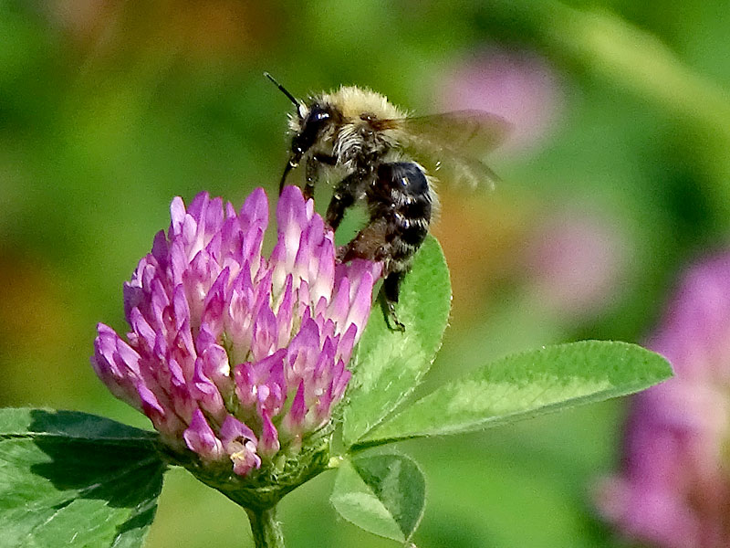

= Accelerating biodiversity research through DNA barcodes, collection and observation data
GBIF Secretariat <training@gbif.org>
:multipage:
:multipage-level: 1
:toc: left
:toclevels: 3
:numbered:
:revnumber: 1
:revdate: June 2021
:title-logo-image: img/web/Bombus_pascuorum_rehbinderi.jpg
:license: https://creativecommons.org/licenses/by-sa/4.0/
:docinfo: shared-head
// :stylesheet: /adoc/gbif-stylesheet/stylesheets/gbif-training.css

ifndef::backend-pdf[]
languageLinks:combined[]
endif::backend-pdf[]

// add cover image to img directory and update filename below
ifndef::backend-pdf[]
:figure-caption!:
.https://www.gbif.org/occurrence/2840632116[Bombus pascuorum (Scopoli, 1763)^] observed in Georgia by Jean-Sébastien Rousseau-Piot (licensed under http://creativecommons.org/licenses/by-nc-nd/4.0/[CC BY-NC^])

endif::backend-pdf[]

:sectnums!:

include::description.en.adoc[]

include::course-prep.en.adoc[]

include::downloads.en.adoc[]

include::software.en.adoc[]

:sectnums:

include::introduction.en.adoc[]

include::research-data.en.adoc[]

include::data-journey.en.adoc[]

include::species-identification.en.adoc[]

include::barcode-depositories.en.adoc[]

include::scholarly-recognition.en.adoc[]

include::unite.en.adoc[]

include::metabarcoding-edna.en.adoc[]

include::bold.en.adoc[]

include::iNaturalist.en.adoc[]

include::data-capture.en.adoc[]

include::data-management.en.adoc[]

include::data-publishing.en.adoc[]

include::conclusion.en.adoc[]

:sectnums!:

// include::assignments.en.adoc[]

include::course-evaluation.en.adoc[]

include::keydocs.en.adoc[]

include::glossary.en.adoc[]

// include::solutions.en.adoc[]

// include::acknowledgements.en.adoc[]

include::colophon.en.adoc[]
